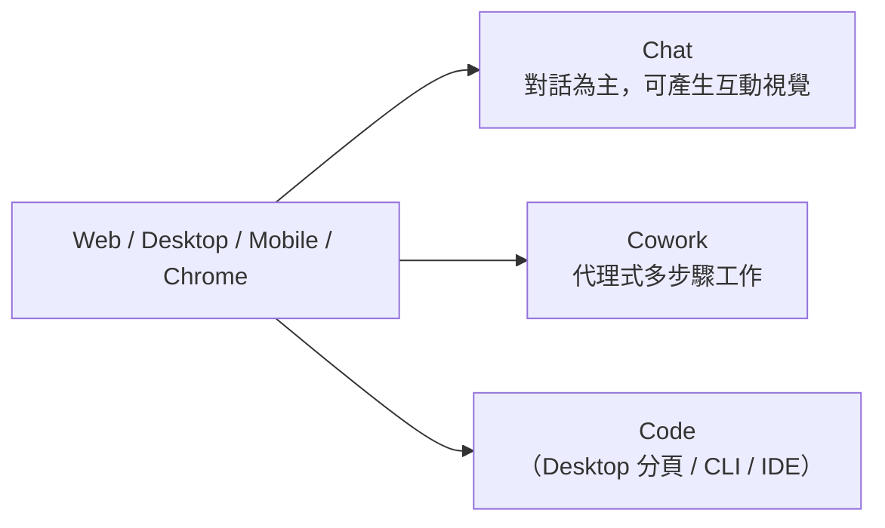

> **This post is in Traditional Chinese Only.**

> Originally published on [iThome 2026 Ironman Contest](https://ithelp.ithome.com.tw/articles/10403332).

> 本篇階段：基礎說明

---

## 今天想回答的問題

Day 1 講完 30 天要幹嘛：把散在三個介面的 AI 工作流，整理成一套能重複用的規範。

但所有「重複用」的前提只有一件事：**這個介面到底記得什麼？記多久？記在哪台機器上？還是在雲端上記著？**

不知道答案，就只能每次重講一次背景。我過去一年的研發日常大概就三件事：訊號處理的參數討論、Python 專案的架構重寫、還有一堆 Word / Excel / PPT。一開始我全部丟給同一個對話框，結果同樣的環境設定，在三個月內講了 N 次。

所以今天還不開始寫程式，先了解一下 Claude 的機制。

---

## 1. Claude 現在有幾個介面、幾種模式

很多文章講「Claude 有三種介面」，2026 年中的實際情況比這個複雜。正確的切法是兩個維度。

**維度一：從哪裡進去**

| Surface | 說明 |
|---|---|
| Web（claude.ai） | 瀏覽器 |
| Claude Desktop | macOS / Windows 原生 App |
| Claude Mobile | iOS / Android |
| Claude in Chrome | 瀏覽器側欄 |
| Claude Code CLI | 終端機裡的 `claude` |
| IDE 擴充 | VS Code |

**維度二：跑哪種模式**

Claude Desktop App 有三個分頁：Chat、Cowork（Dispatch 與較長的 agentic 工作）、Code，這三個分頁背後是三套不同的執行模型跟記憶模型。

Web 跟 Mobile 上，Chat 與 Cowork 共用同一個入口，在訊息框左下角切換。Chrome 側欄則直接就是 Cowork session，沒有切換器。

---

## 2. 第一層：Chat 的記憶

Chat 的記憶其實是五個獨立的東西疊在一起，我過去也把它們混成一個「記憶」在講，然後就會困惑為什麼它有時候記得有時候不記得。

### 2.1 Context window：工作台，不是記憶

這是當前對話塞得下的 token 量，例如 Opus 5 在付費方案上似乎是支援 1M token。

重點是它不是記憶，是工作台，對話結束就沒了。而且 context window 會留一塊給 Claude 的回覆，實際能用的對話長度比帳面數字小。在啟用 code execution 的付費方案上，快撞上限時 Claude 會自動摘要前面的訊息繼續跑。

這個自動摘要待會講腦科學的時候會回來對照。

### 2.2 Search past chats：被動觸發的 RAG

付費方案（Pro）可以在 Web、Desktop 與 Mobile 上搜尋過去的對話，走的是 RAG，並且會以 tool call 的形式顯示在對話裡。

搜尋範圍有明確邊界：所有 Project 之外的對話，加上當下所在 Project 內部的對話。

這條是以被動形式處理的，得問它「我們之前討論過什麼」，它才會去撈，不會預設就把過去全塞進來。

### 2.3 Memory：主動生成的記憶條目

這是 2026 年變動最大的一塊。新版記憶適用於 free、Pro、Max，涵蓋 web、Desktop 與 Mobile 的對話，**目前不涵蓋 Cowork**。

新舊版的機制差異值得記一下：

| | 舊版 | 新版 |
|---|---|---|
| 儲存形式 | 跨對話歷史的綜合摘要 | 分類組織的個別條目 |
| 更新時機 | 每 24 小時一次 | 聊天當下即時讀寫 |
| 設定位置 | Settings > Capabilities | Settings > Memory |

它記什麼？官方寫的是「有助於協作的工作相關脈絡」：角色與專業背景、溝通偏好與工作風格、技術偏好與程式風格、專案細節與進行中的工作。

控制方式在 Settings > Memory 的「Generate memory from chats」。關閉時有兩個選項，Pause memory 保留既有記憶但不用也不新增，Reset memory 則是永久刪光包含 Project 記憶，救不回來。

有個陷阱：對話過期或被刪除時，由它產生的記憶條目**不會**跟著消失，得自己去刪；舊版的行為剛好相反，刪掉的對話會從記憶綜合中移除。

### 2.4 Project 記憶：隔離牆

每個 Project 有自己獨立的記憶空間與專屬摘要，跟其他 Project 或非 Project 對話分開，Project 邊界是一種安全防護，讓敏感對話被限制在裡面。

這影響很大。把「生醫訊號處理」跟「個人網頁重構」放在不同 Project，就不會發生問網頁 SEO 的時候，它突然拿 PPG 波形來打比方。

### 2.5 Incognito

在 Project 之外開新對話時，右上角有個幽靈圖示，點下去開的臨時對話不會存進歷史，之後搜尋過去對話也撈不到它。

---

## 3. 第二層：Cowork，以及它跟 Chat 差在哪

關於 Chat 跟 Cowork 的差別不是 UI，是執行模型。

### 3.1 Cowork 在幹嘛

官方的說法是：描述一個結果，走開，回來拿到完成的工作。排版好的文件、整理好的檔案、綜合過的研究。Cowork 的 session 遠端在雲端執行（beta），所以 session 與檔案跟著 Claude 帳號走，桌面、網頁、行動裝置之間換來換去都在。

流程大致是：Claude 分析請求建立計畫、必要時把複雜工作拆成子任務、在 Anthropic 伺服器的隔離環境裡跑程式與 shell、適當時平行協調多條工作流、把產出送回 session。

需要電腦上的東西時，它透過那台電腦的 Claude Desktop App 來拿，例如本機檔案或瀏覽器。

### 3.2 Chat vs Cowork

| 面向 | Chat | Cowork |
|---|---|---|
| 本質 | 一問一答，人去執行 | 代理式，它去執行 |
| 執行環境 | 模型推論，無持久工作區 | Anthropic 伺服器上的隔離環境 |
| 關掉電腦 | 沒有「進行中」的概念 | 工作在背景繼續，闔上筆電照跑 |
| 本機檔案 | 手動上傳 | 讀寫已連結的資料夾（需 Desktop App 開著） |
| 排程 | 無 | 排程任務在雲端執行，不需裝置在線 |
| 記憶 | Chat memory | 不適用 Chat memory，但 Cowork 自己有一個 Pool |
| 方案 | 免費可用 | 僅付費 |

官方記憶文件說「memory 目前不適用於 Cowork」，Cowork 文件又說「Cowork 有記憶」。兩句話不矛盾，**它們是兩池不同的記憶**。

Cowork 的那池會學工作方式、跨 session 保留脈絡，並且明確排除密碼、財務、健康這類敏感資料，隨時可以查看編輯刪除。

### 3.3 一個很容易被忽略的設定分裂

**Desktop App 裡 Cowork 分頁的 skills、plugins 與 connectors，來自 Customize 設定，透過 claude.ai 帳號同步，不是來自 CLI 的 `~/.claude` 目錄。**

換句話說，在 `~/.claude/skills/` 裡辛苦寫的 skill，Cowork 看不到。

我發現這件事的時候，正好在納悶為什麼同一台電腦上，Code 分頁會自動套用我的繪圖規範，Cowork 分頁完全不理。原因就在這，它們的設定根本不是同一份。

---

## 4. 第三層：Claude Code 的記憶

Claude Code 的哲學跟前兩者完全不同：**它把記憶放在檔案系統裡，而且是純文字。**

每個 session 都以全新的 context window 開始，靠兩個機制把知識帶過 session 邊界。一個是 CLAUDE.md，寫給 Claude 的持久指令；另一個是 auto memory，Claude 根據糾正跟偏好自己寫的筆記。

### 4.1 CLAUDE.md：寫給它的

四個層級，依載入順序由廣到窄：

| Scope | 位置 | 用途 | 分享對象 |
|---|---|---|---|
| Managed policy | macOS `/Library/Application Support/ClaudeCode/CLAUDE.md`；Linux/WSL `/etc/claude-code/CLAUDE.md`；Windows `C:\Program Files\ClaudeCode\CLAUDE.md` | 組織層級 | 全組織 |
| User | `~/.claude/CLAUDE.md` | 跨所有專案的個人偏好 | 只有自己 |
| Project | `./CLAUDE.md` 或 `./.claude/CLAUDE.md` | 團隊共用 | 版控 |
| Local | `./CLAUDE.local.md` | 專案內個人偏好，記得加 `.gitignore` | 只有自己 |

幾個細節：

不是覆寫，是串接。
> 所有找到的檔案會一起被串進 context，從檔案系統根目錄往下排到工作目錄，離啟動位置越近的指令被越晚讀到。

大小有門檻。
> 官方建議每個 CLAUDE.md 控制在 200 行以下，更長的檔案吃更多 context，遵循度反而下降。

它不是硬性設定。
> Claude 把 CLAUDE.md 當 context，不是強制執行的組態。要無條件封鎖某個行為，得用 PreToolUse hook。

`@` 匯入不會省 context。
> 被匯入的檔案在啟動時就展開載入，跟引用它的 CLAUDE.md 一起算。

compaction 之後，專案根目錄的 CLAUDE.md 會活下來，`/compact` 後 Claude 從磁碟重讀重新注入。但子目錄的巢狀 CLAUDE.md 跟帶 `paths:` frontmatter 的 rules 不會自動回來。

### 4.2 Auto memory：Claude 寫給自己的

Auto memory 讓 Claude 跨 session 累積知識，不用寫任何東西。它工作時自己存筆記：建置指令、除錯洞察、架構筆記、程式風格偏好。不是每個 session 都會存，它會判斷這條資訊未來用不用得到。

規格重點：

預設開啟，`/memory` 裡有切換鈕，狀態存進 `~/.claude/settings.json` 的 `autoMemoryEnabled`。

每個專案有自己的記憶目錄，在 `~/.claude/projects/<project>/memory/`。`<project>` 路徑由 git repository 推導，所以同一個 repo 的所有 worktree 與子目錄共用同一份。

目錄裡有一個 `MEMORY.md` 當索引，加上選用的主題檔。每次對話開始載入 `MEMORY.md` 的前 200 行或前 25KB，先到者為準，超過的不載入。像 `debugging.md`、`patterns.md` 這種主題檔啟動時不載入，Claude 需要時才自己去讀。

**最重要的一條：auto memory 是電腦本機的，不跨機器、不跨雲端環境分享。**

### 4.3 兩者對照

| | CLAUDE.md | Auto memory |
|---|---|---|
| 誰寫的 | 自己 | Claude |
| 內容 | 指令與規則 | 學到的東西與模式 |
| 範圍 | Project、user 或 org | 每個 repository，跨 worktree 共用 |
| 載入 | 每個 session | 每個 session（前 200 行或 25KB） |
| 適用於 | 程式標準、工作流、專案架構 | 建置指令、除錯洞察、Claude 發現的偏好 |

建議分工是：CLAUDE.md 只放跨專案的硬規則，專案級的教訓交給 auto memory。前者要人工審核，後者可以自動長。

---

## 5. 同一個任務丟給 Cowork 跟 Code，會怎麼跑？

### 5.1 Desktop 的 Code 分頁等於 Claude Code 嗎？

幾乎是，但不完全。

如果已經在用 Claude Code CLI，Desktop 跑的是相同的底層引擎，只是換上圖形介面。同一電腦、同一個專案可以同時開兩個，各自維護獨立的 session 歷史，但透過 CLAUDE.md 共用設定與專案記憶。

共用的部分很完整：專案裡的 CLAUDE.md 與 CLAUDE.local.md、`~/.claude.json` 或 `.mcp.json` 的 MCP servers、設定中的 hooks 與 skills、以及 `~/.claude/settings.json`，兩邊都吃。

不等於的部分，例如 Desktop 沒有：`--print` / `--output-format` 這類非互動模式；還有部分終端指令，例如 `/permissions` 會直接回「isn't available in this environment」。

Desktop 獨有的則有：對 Git repository，每個 session 用 Git worktree 拿專案的獨立副本，所以一個 session 的改動不會波及另一個。加上視覺化 diff 審閱、Browser pane、iOS Simulator pane、以及 Dispatch 進來的 session。

結論是 Desktop Code 就是 Claude Code 的 GUI 版，不是另一個產品，能力上沒有落差。

> 這節的 CLI 對照是 2026 年 8 月 16 日，我在自己電腦上實測的結果，產品迭代很快，不確定會不會一直維持相同模式。

### 5.2 具體場景

假設任務是「把 `./raw_data/` 底下 40 個 CSV 的量測資料整理成一份含統計圖表的報告」。

在 Cowork 分頁，描述結果，它自己規劃步驟、拆子任務、在隔離環境跑程式，把 .docx / .xlsx 丟回 session 提供下載。它不會在 repo 裡留下一個可維護的 `analysis.py`，它記得偏好（Cowork memory），但不會遵守 `~/.claude/CLAUDE.md`。適合一次性交付。

在 Code 分頁，它會讀 CLAUDE.md、套用繪圖規範（例如我設定 GridSpec、dpi=300、y 軸 5% 動態留白），建立一個有結構的專案，之後就可以 `git diff` 審閱、可以重跑、可以打包。它還會把這次學到的東西寫進 auto memory，例如某個 CSV 的欄位帶 BOM，下次自動避開。適合會變成長久的東西。

判斷準則很簡單~~粗暴~~：這個產出有沒有機會再跑好幾次？會就是 Code :)

---

## 6. App 版遠端控制：三條完全不同的路

很多人以為手機版 Claude 就是小螢幕聊天，實際上它可以驅動桌上那台電腦。

Claude Code 沒有獨立的行動 App。cloud sessions 與 Remote Control 都在 Claude App 的 Code 分頁裡，Dispatch 則是在 App 裡用訊息交付的任務。

| 功能 | 連到什麼 | 何時使用 |
|---|---|---|
| Claude Code on the web | 雲端基礎設施上的 cloud session | repo 在 GitHub，任務要在收起手機後能繼續跑 |
| Remote Control | 執行在電腦上的 Claude Code session | 工作需要本機檔案系統、工具或 MCP servers |
| Dispatch | 電腦上的 Desktop App | 交付任務，讓 Dispatch 決定怎麼執行（需 Pro 或 Max） |

判斷方式很單純：電腦會關機就用 cloud sessions；Remote Control 與 Dispatch 驅動的是我們自己的電腦，所以它得保持開機並跑著 Claude Code 或 Desktop App。電腦在 Remote Control session 期間睡著的話，Claude Code 會在它回線時重新連上。

Remote Control 的啟動方式是在電腦上跑 `claude remote-control`，或在已開的 session 裡下 `/remote-control`，然後掃終端機顯示的 QR code，或直接從 App 的 Code 清單挑。在 App 裡加的附件也會到達本機 session：照片直接當訊息的一部分，其他檔案 Claude Code 會下載到電腦上，再以 `@` 引用傳進去。

Dispatch 的設計哲學不太一樣，它比較像自己跟助理的 LINE 群組。不用為每個任務開新 session，而是一條不會重置的持久執行緒，Claude 保留先前任務的脈絡。通勤路上用手機傳訊息，坐下來後從桌機接續，同一段對話、同一份脈絡。

邏輯：指派任務後，Claude 判斷需要哪種工作並啟動對應 session。開發任務進 Claude Code，知識工作進 Cowork。修 bug、更新相依套件、跑測試、開 PR 通常路由到 Code；研究、文件編輯與試算表工作留在 Cowork。無論走哪邊，該 session 會帶著 Dispatch 標記出現在對應側欄，完成或需要核准時手機會收到推播。

> **實際上我只有簡單測試，上述第 6 點內容是透過 Claude 告訴我更完整的資訊的。**

### 安全性

官方文件在這裡寫了一段罕見地直白的警語：

> 給行動 AI agent 對桌面 AI agent 的遠端控制權，會建立一條指令鏈。來自手機的指令可以在電腦上觸發真實動作：讀取、移動或刪除本機檔案、與已連接的服務互動、控制瀏覽器、透過 computer use 使用桌面應用程式。這很強大，但也意味著錯誤，或模型沿路遇到的惡意內容，可能造成真實後果。一個被操縱的指令、一個非預期的命令、或在瀏覽器中開啟的釣魚連結，都可能連鎖成難以或不可能復原的動作。

> 只在能接受它**可能**做什麼（而不只是打算讓它做什麼）的前提下，才連接這些 agent。

***限制：桌機必須是活躍的；只有一條連續執行緒，無法開新的或同時管理多條。***

---

## 7. 記憶同步矩陣

下面矩陣統整了所有記憶或狀態的組合情況，同步狀況不是「全部同步」或「全部不同步」。

| 記憶／狀態 | 綁定對象 | Web | Desktop | Mobile | 備註 |
|---|---|---|---|---|---|
| Chat memory 條目 | claude.ai 帳號 | ✅ | ✅ | ✅ | 三個 surface 一致 |
| Project 記憶 | 帳號 + Project | ✅ | ✅ | ✅ | 每個 Project 獨立池 |
| 跨對話搜尋 | 帳號 | ✅ | ✅ | ✅ | 付費方案 |
| Cowork session 與檔案 | 帳號 | ✅ | ✅ | ✅ | 可中途換 surface |
| Cowork 記憶 | 帳號 | ✅ | ✅ | ✅ | 與 Chat memory 是不同池 |
| Cowork 本機檔案存取 | 該台電腦 | ⚠️ | ✅ | ⚠️ | 雲端 session 只在該電腦 Desktop App 開著時碰得到本機檔案 |
| Live artifacts | 該台電腦 | ❌ | ✅ | ❌ | 僅 Desktop App |
| CLAUDE.md | 檔案系統／版控 | ✅ | ✅ | ❌ | 跟著 repo 走靠 git 同步；Claude Code on the web 讀 GitHub repo 時同樣生效 |
| Claude Code auto memory | **單機** | ❌ | ✅ | ❌ | machine-local，不跨機器或雲端環境 |

三個實務結論。

**Chat 的記憶是真的同步的。** 綁帳號，三個 surface 一致。在手機上跟它說「我以後 Python 圖表都要 dpi=300」，回到電腦上它記得。

**Claude Code 的 auto memory 是真的不同步的。** 它在公司學到的東西回家不會知道，想跨電腦共用，唯一可靠的路是把它升級成 CLAUDE.md 或 `.claude/rules/` 並進版控。

**Cowork 的雲端與本機是混合的。** session 本身在雲端跟著帳號跨 surface，但本機檔案存取、本機 connector、瀏覽器使用、computer use 這幾項要透過 Claude Desktop App，需要那台電腦上的 App 開著。

換 surface 的官方流程：在任何 surface 開始任務，從另一個 surface 開啟同一個 session 檢查進度或改變方向，最後在任何地方取回產出。

---

## 8. 三介面分工假說

現在嘗試提出這 30 天要驗的假說。

### H1：claude.ai 的比較利益是「互動化界面的產生器」

理由是 Chat 在 2026 年多了一個過去沒有的維度。Claude 可以在對話中直接生成客製化的圖表、示意圖與互動視覺，當視覺比文字更能解釋某件事的時候，它會從零建一個，內嵌渲染成回應的一部分。視覺出現後，可以跟它互動，點按鈕、調滑桿、展開全螢幕，然後繼續追問，Claude 也會隨對話更新或重建它。

它跟 Artifacts 的分工很清楚：artifacts 是永久的工具與文件，設計來被分享或下載；custom visuals 是內嵌、隨對話演化的。

### H2：Claude Desktop 的比較利益是「本機檔案 × 跨應用程式」

**可證偽的預測：** 在 Desktop 上會明顯比在 claude.ai 上省事，如果還是要自己手動上傳跟下載，這樣就有問題。

### H3：Claude Code 基本上什麼都能做，但得先付「規範稅」

Claude Code 能寫程式、能連硬體、能部署、能做 Office、能做網頁、能排程。它的能力上界幾乎沒有邊界，因為它有檔案系統、有 shell、有 MCP、有 hooks。

代價是得先把規範寫下來，否則每次都從零開始猜。CLAUDE.md、rules、skills、agents，全部都是前置的具體形式。

**Day 30 再來回顧看看。**

---

## 9. 別家有沒有類似的機制？

既然要談記憶，也來談談其他 LLM ，以下是 2026 年中的一些對照。

> 下面全由 Claude 整理，不確定是否存在偏頗。

### ChatGPT

記憶架構是雙層的。第一層是 saved memories，離散的事實，可以在設定裡查看、新增、個別刪除。第二層是 reference chat history，從過去對話的較廣內容裡提取，不是固定的事實清單。

底層記憶由 OpenAI 稱為 Dreaming 的背景程序產生，Dreaming V3 在 2026 年 6 月 4 日開始推出。它非同步地跨多個過去對話讀取，維護一個綜合的記憶狀態，在每個新對話開始時注入 context。同一天起，OpenAI 把 saved memories 那套改稱 legacy，預設改為單一 Memory 控制項加上可編輯的記憶摘要。

Project 隔離也有。設成 project-only 的時候，ChatGPT 只從該 Project 內既有的對話取脈絡，不拉全域 saved memories，該 Project 累積的新脈絡也不會回寫到帳號層級。記憶則在 iOS、Android、macOS、Windows 與網頁間同步。

> 跟 Claude 對照：架構高度相似。差別在 Claude 的新版記憶是即時讀寫，ChatGPT 的 Dreaming 是非同步背景綜合。

### Gemini

Google 的命名比較亂，實際上是三個獨立的東西。Personal context 讓 Gemini 記住早先對話的關鍵細節與偏好，沒有東西被書籤化，它自己讀過先前的對話並浮現相關事實。設定在 gemini.google.com 的 Settings & help > Personal Intelligence。

限制條件比較多：需年滿 18 歲、以個人 Google 帳號登入（工作、學校或受監護帳號不適用）、且必須開啟 Keep Activity。適用範圍只有 Gemini 行動 App、gemini.google.com、Gemini in Chrome 與智慧手錶，Gems 或 Live chats 不算。

有個設計很棒：想確認 Gemini 有沒有用過去對話，直接問它「Did you use any info from past chats?」

刪除邏輯跟 Claude 相反。要刪掉 Gemini 記住的某件事，得從 Gemini Apps activity 刪掉所有含該資訊的對話。底層還有保留期設定，預設 18 個月自動刪除，可改 3 個月、36 個月或手動。

> 跟 Claude 對照：記憶與對話紀錄的耦合更緊。Claude 是「刪對話不等於刪記憶」，Gemini 是「要刪記憶得刪對話」。兩種設計各有道理，但要知道自己在用哪一種。

### Grok

2026 年 5 月 18 日的 Grok 4.3 帶來兩個跟記憶有關的功能：cross-conversation memory，讓 Grok 在 session 間帶著脈絡前進；以及 Skills。

Skills 這個設計值得注意。相較於儲存事實（「我偏好簡潔的回覆」），Skills 儲存程序性與風格性的知識：報告的排版慣例、某個工作流的步驟順序、偏好的文件結構。Grok 偵測到適用時會自動啟動，不需要被提示。

地區限制是它最大的特點。Grok 的記憶 2025 年 4 月推出時明確排除歐盟與英國，截至 2026 年 7 月似乎正觸及部分歐盟與英國帳號，但仍標 beta，xAI 沒有發佈完整推出的公告。另外它的記憶不會轉移到其他平台，也沒有匯出功能。

> 跟 Claude 對照：Skills 的概念跟 Claude 的 Skills / CLAUDE.md 相當接近，都是把程序封裝成可自動觸發的能力。這是 2026 年一個明顯的產業收斂方向：光記事實不夠，要記做法。差別在 Claude 的 Skills 是自己寫的檔案，可版控可分享；Grok 的目前綁在平台內。

### Meta AI

跟 Meta AI 對話時，用「Remember」或「Save」這類字眼提交希望它記住的細節，它也可能在分享相關細節時自動辨識並儲存。存好之後訊息後面會出現「Memory updated」，點下去看得到清單。

跨 App 同步是它的特色：在任何跟 Meta AI 對話的地方都能查看與管理，一處儲存或刪除等於全部。把多個帳號加進同一個 Accounts Centre 之後，這些帳號的對話細節也會被一起記住。範圍限制是嚴格限定在一對一對話，避免溢出到群組。

> 跟 Claude 對照：Meta AI 的記憶是社交產品導向的（偏好、飲食限制、生日），沒有 Project 隔離、沒有檔案級規範、也沒有 agent session 的概念。它跟本系列討論的工作流記憶不是同一個問題。

### 橫向總表

| 能力 | Claude | ChatGPT | Gemini | Grok | Meta AI |
|---|---|---|---|---|---|
| 自動記憶條目 | ✅ | ✅ | ✅ | ✅ | ✅ |
| 可查看／編輯／刪除 | ✅ | ✅ | ⚠️ 需刪對話 | ✅ | ✅ |
| 專案級記憶隔離 | ✅ Project | ✅ Project | ❌ Gems 不隔離記憶 | ⚠️ Projects 部分支援 | ❌ |
| 臨時／無痕模式 | ✅ | ✅ | ✅ | ❌ | ❌ |
| 跨裝置同步 | ✅ | ✅ | ✅ | ⚠️ 不穩 | ✅ |
| 程序性記憶（做法而非事實） | ✅ Skills / CLAUDE.md | ⚠️ Custom Instructions | ⚠️ Saved info | ✅ Skills | ❌ |
| 檔案系統級、可版控的記憶 | ✅ 僅 Claude Code；Cowork 的 skills 走帳號設定 | ❌ | ❌ | ❌ | ❌ |
| 手機驅動桌面 agent | ✅ Dispatch / Remote Control | ❌ | ❌ | ❌ | ❌ |
| 地區限制 | 少 | 少 | 中（帳號類型／年齡） | 高（EU/UK） | 中 |

> 2026 年真正的差異化：可版控的檔案級記憶，以及跨裝置的 agent 控制鏈。前者決定記憶能不能進入團隊協作與 CI，後者決定 AI 是「打開的工具」還是「一直在跑的同事」。

---

## 10. 延伸：記憶機制在心理學與腦科學裡長什麼樣

整篇都在講記憶，那就把心理學跟腦科學的關於「記憶」的部分拿出來講講。

### 10.1 從多重儲存到工作記憶

早期的記憶模型是線性的，可以把記憶解釋成一條產線：接收感官訊息，傳到短期記憶，再到長期記憶。

這個模型解釋不了一些現象，於是有了工作記憶模型。初始版本主張三個功能元件：central executive（中央執行系統）是一個注意力容量有限的控制系統，負責協調兩個從屬系統，phonological loop（語音迴路）跟 visuospatial sketchpad（視覺空間模板）。前者以口語形式儲存維持資訊，後者專責視覺空間資訊。

關鍵在於這兩個從屬系統是獨立的，不依賴相同的儲存資源，語音與視覺空間編碼彷彿實作在不同的心智硬體上。但它們仍得由同一個中央執行系統協調，所以彼此之間會競爭。在 2000 年，補了第四個元件 episodic buffer，用來把不同來源的資訊綁成單一表徵，並連結長期記憶。

### 10.2 容量：7 還是 4？

這是心理學裡最有名的一場數字之爭。

Miller（1956）總結證據，指出人在短期記憶任務中大概能記住七個 chunk。不過那個數字更像粗估與修辭手法，不是真正的容量上限。Cowan（2001a）回顧了大量實驗證據，涵蓋口語與非口語材料、視覺與聽覺呈現、空間與時間資訊、單一與雙重任務，提出正常成人的注意焦點容量平均約四個 chunk。

爭議至今沒有定論。四 chunk 上限並非共識，有研究者主張接近七，Reynolds 等人估成人為五，van den Berg、Awh 與 Ma 測了不同數學模型後，最佳擬合估出來是 6.4。

這場爭論之所以重要，是因為它指出一件事：**容量不是絕對的，取決於一個 chunk 有多大，而 chunk 的大小取決於長期知識。** 專家看起來記憶力好，很大程度上是因為他們的 chunk 更大。

### 10.3 長期記憶：系統固化

短期的東西怎麼變成長期的？

對新經驗的意識記憶，最初同時依賴儲存在海馬迴與新皮質的資訊。系統固化（systems consolidation）是海馬迴引導新皮質重組這些資訊的過程，讓記憶最終獨立於海馬迴。早期證據來自逆行性失憶症研究，海馬迴的損傷會傷害近期形成的記憶，但通常保留久遠的。近年研究開始刻畫兩者對話的神經機制，例如 sharp wave ripple 期間的 neural replay。

計算模型給了一個很優雅的理由：海馬迴適合快速線上編碼，但這種快速可塑性讓表徵容易被覆寫；新皮質學得慢，透過編碼非重疊、一般化、結構化的資訊，更有效率地把新東西整合進既有知識。

### 10.4 對照表：腦科學／心理學 ↔ LLM

| 腦科學／心理學 | Claude 的對應物 | 對應得好嗎 |
|---|---|---|
| 感官暫存 | 當前訊息與附件 | 尚可 |
| 工作記憶（Baddeley） | Context window | 好 |
| 中央執行的注意力配置 | CLAUDE.md 與工具說明競爭 context 預算 | 好 |
| Chunk 容量（4 或 7） | Token 上限（200K / 500K / 1M） | 差，數量級完全不同 |
| 語音迴路 vs 視覺空間模板 | 單一 token 序列，無模態分離 | 差 |
| 摘要式重編碼 | `/compact`、自動摘要 | 好 |
| 系統固化（海馬迴 → 新皮質） | Auto memory 寫入、Chat memory 即時更新 | 中上 |
| Neural replay | 背景記憶生成程序（如 Dreaming） | 有趣但別當真 ~~(誰知道以後會不會是真的)~~ |
| 語意記憶（事實） | Memory entries、`~/.claude/CLAUDE.md` | 好 |
| 程序記憶（怎麼做） | Skills、`.claude/rules/` | 好 |
| 情節記憶（發生過什麼） | 對話歷史 + 跨對話搜尋 | 好 |
| 提取線索 | RAG 搜尋、`@` 檔案引用 | 好 |
| 遺忘曲線 | `cleanupPeriodDays` 的 session 清理 | 中，是模型設計政策 |

### 10.5 三個對得特別好的地方

**工作記憶 ≈ context window，連「有限」的方式都很像。**

Baddeley 模型裡的中央執行系統注意力容量有限，兩個從屬系統會互相搶資源。官方文件講 CLAUDE.md 的那段話幾乎在講同一件事：CLAUDE.md 在每個 session 開始時被載入 context window，對話時一起消耗 token；因為它是 context 而非強制設定，怎麼寫會影響 Claude 遵循的可靠程度；目標是控制在 200 行以下，更長的檔案消耗更多 context 並降低遵循度。

翻成心理學的語言：每當 CLAUDE.md 每多一行，就多佔一點注意力資源，剩給實際任務的就更少。這跟人做多工時的表現衰減是同一個道理。所以「寫得越詳細越好」是錯的，正確的是寫得具體且精簡。官方甚至給了寫法建議：寫具體到可驗證的指令，例如「Use 2-space indentation」而不是「Format code properly」。

**快慢兩套學習系統，兩邊都有。**

海馬迴快速編碼但脆弱、新皮質緩慢但穩固，這個雙速架構在 Claude Code 裡有一個近乎一比一的對應。

快而脆弱的是 session 內的對話加上 auto memory 的即時寫入，改得快，但 machine-local 不跨機器，也可能被下次改寫。慢而穩固的是進了版控的 CLAUDE.md，改得慢，要 commit 要 review，但跨機器、跨團隊、跨時間都成立。

我的規則是：跨專案的全域規則先收進一份候選清單，由我親自人工審核後才改進入 CLAUDE.md。這其實可以說是人工模擬一次系統固化，重複出現、跨情境成立的東西，才值得從海馬迴搬到新皮質。

**Project 隔離 ≈ 情境依賴的提取。**

心理學裡有個現象叫 context-dependent memory，在什麼情境學的，在什麼情境比較容易想起來。Claude 的 Project 記憶隔離、ChatGPT 的 project-only memory，本質上是把這件事做成產品規格，刻意讓某些記憶只在特定情境下可提取。

### 10.6 兩個對得很差、不應亂類比的地方

**模態分離。** Baddeley 模型的核心洞見之一是語音跟視覺空間走不同的硬體，所以可以一邊聽字一邊看圖而干擾很小。LLM 沒有這個結構，所有東西最後都是同一條 token 序列。

**遺忘。** 人的遺忘是衰退與干擾的自然結果，LLM 的遺忘是政策：超出 context 就截斷、超過 200 行就不載入、超過保留期就刪檔。這個差異的實務意義是，可以工程化地控制 AI 記得什麼，但人類控制不了自己記得什麼。

還有一件事情值得注意。Claude 的「記憶」是執行時被動態注入 context 的文字，不是一個持續存在、跨所有對話都在運作的意識。同一時刻，另一個 Claude 實例在跟別人講話，並不知道我們這裡發生了什麼。這跟人類記憶的連續性有本質差異。把它當成一份會自動整理的筆記，比較好 ~~(比當成一個記得我全部需求的朋友要準確且健康得多 XD)~~ 。

---

## 11. 小結

| 層級 | 誰在記 | 記在哪 | 跨機器 | 能改嗎 |
|---|---|---|---|---|
| Context window | 模型 | RAM（比喻） | — | 只能靠 compact |
| Chat memory | Claude 自動 | 帳號雲端 | ✅ | ✅ Settings > Memory |
| Project memory | Claude 自動 | 帳號雲端（隔離） | ✅ | ✅ |
| Cowork memory | Claude 自動 | 帳號雲端（獨立池） | ✅ | ✅ |
| CLAUDE.md | 我 | 檔案系統 / 版控 | ✅ 靠 git ~~(手動複製貼上)~~ | ✅ 直接編輯 |
| Auto memory | Claude 自動 | `~/.claude/projects/*/memory/` | ❌ | ✅ `/memory` |

三句話帶走：

1. claude.ai 記這個帳號，Claude Code 記這個專案。前者綁帳號跨裝置，後者綁檔案綁機器。
2. Cowork 跟 Chat 不共用記憶池，而且 Cowork 的 skills 來自 claude.ai 帳號設定，非 `~/.claude`。
3. 唯一能跨機器、跨團隊、跨時間活下來的記憶，是寫進版控的那份。

明天 Day 3 繼續...

---

## 參考資料

> 以下由 Claude 整理，已檢查過，並且官方文件可以手動切換英文或繁體中文閱讀。

### Anthropic 官方文件

- Use Claude's chat search and memory to build on previous context — https://support.claude.com/en/articles/11817273-use-claude-s-chat-search-and-memory-to-build-on-previous-context
- Get started with Claude Cowork — https://support.claude.com/en/articles/13345190-get-started-with-claude-cowork
- Use Claude Cowork on web, desktop, and mobile — https://support.claude.com/en/articles/15520349-use-claude-cowork-on-web-desktop-and-mobile
- Assign tasks from anywhere in Claude Cowork (Dispatch) — https://support.claude.com/en/articles/13947068-assign-tasks-from-anywhere-in-claude-cowork
- Let Claude use your computer in Cowork — https://support.claude.com/en/articles/14128542-let-claude-use-your-computer-in-cowork
- Claude Cowork architecture overview — https://support.claude.com/en/articles/14479288
- Use Claude Cowork safely — https://support.claude.com/en/articles/13364135
- Custom visuals in chat and Cowork — https://support.claude.com/en/articles/13979539-custom-visuals-in-chat-and-cowork
- Visual and interactive content — https://support.claude.com/en/articles/13641943-visual-and-interactive-content
- How large is the context window on paid Claude plans? — https://support.claude.com/en/articles/8606394-how-large-is-the-context-window-on-paid-claude-plans
- How do usage and length limits work? — https://support.claude.com/en/articles/11647753-how-do-usage-and-length-limits-work
- Use incognito chats — https://support.claude.com/en/articles/12260368-use-incognito-chats
- Import and export your memory from Claude — https://support.claude.com/en/articles/12123587-importing-and-exporting-your-memory-from-claude
- Release notes — https://support.claude.com/en/articles/12138966-release-notes

### Claude Code 官方文件

- How Claude remembers your project（CLAUDE.md 與 auto memory）— https://code.claude.com/docs/en/memory
- Desktop application（Code 分頁完整參考、CLI 對照表）— https://code.claude.com/docs/en/desktop
- Claude Code on mobile — https://code.claude.com/docs/en/mobile
- Remote Control — https://code.claude.com/docs/en/remote-control
- Claude Code on the web — https://code.claude.com/docs/en/claude-code-on-the-web
- Skills — https://code.claude.com/docs/en/skills
- Hooks — https://code.claude.com/docs/en/hooks-guide

### Anthropic 部落格

- Bringing memory to Claude — https://www.anthropic.com/news/memory
- Claude builds interactive visuals right in your conversation — https://claude.com/blog/claude-builds-visuals
- Claude Cowork research preview — https://claude.com/blog/cowork-research-preview

### 其他 AI 平台

- OpenAI — Memory FAQ — https://help.openai.com/en/articles/8590148-memory-faq
- OpenAI — Memory and new controls for ChatGPT — https://openai.com/index/memory-and-new-controls-for-chatgpt/
- Google — Get personalization with memory of your past Gemini chats — https://support.google.com/gemini/answer/16598469
- Meta — Remember details about you on Meta AI — https://www.meta.com/en-gb/help/artificial-intelligence/948583263661526/
- Meta — Have Meta AI remember details about you across chats — https://www.meta.com/help/artificial-intelligence/1887269842194694/
- xAI Grok 記憶功能報導 — https://techcrunch.com/2025/04/16/xai-adds-a-memory-feature-to-grok

### 心理學與腦科學

- Baddeley's model of working memory（Wikipedia）— https://en.wikipedia.org/wiki/Baddeley's_model_of_working_memory
- Working Memory Model（Simply Psychology）— https://www.simplypsychology.org/working-memory.html
- Components — Central Executive, Phonological Loop, Visuospatial Sketchpad（LibreTexts）— https://socialsci.libretexts.org/Bookshelves/Psychology/Cognitive_Psychology/Cognitive_Psychology_(Andrade_and_Walker)/05:_Working_Memory/5.02:_Components-Central_Executive_Phonological_Loop_Visuospatial_Sketchpad
- Cowan, N. (2001). The magical number 4 in short-term memory — https://philpapers.org/rec/COWTMN
- Modelling Working Memory Capacity: Is the Magical Number Four, Seven...（Journal of Cognition, 2024）— https://journalofcognition.org/articles/10.5334/joc.387
- Squire, Genzel, Wixted & Morris (2015). Memory consolidation. *Cold Spring Harbor Perspectives in Biology* — https://cshperspectives.cshlp.org/content/7/8/a021766.full ／ PubMed: https://pubmed.ncbi.nlm.nih.gov/26238360/
- New methods for understanding systems consolidation（Learning & Memory, 2013）— https://learnmem.cshlp.org/content/20/10/553.full
- Shift from Hippocampal to Neocortical Centered Retrieval Network with Consolidation（PMC）— https://ncbi.nlm.nih.gov/pmc/articles/PMC6664975

> 註：本文所述之產品規格以 2026 年 8 月 16 日為準，LLM 的迭代快速，行為規則等可能變動很快，請以官方文件為準 ~~(廢話)~~ 。
